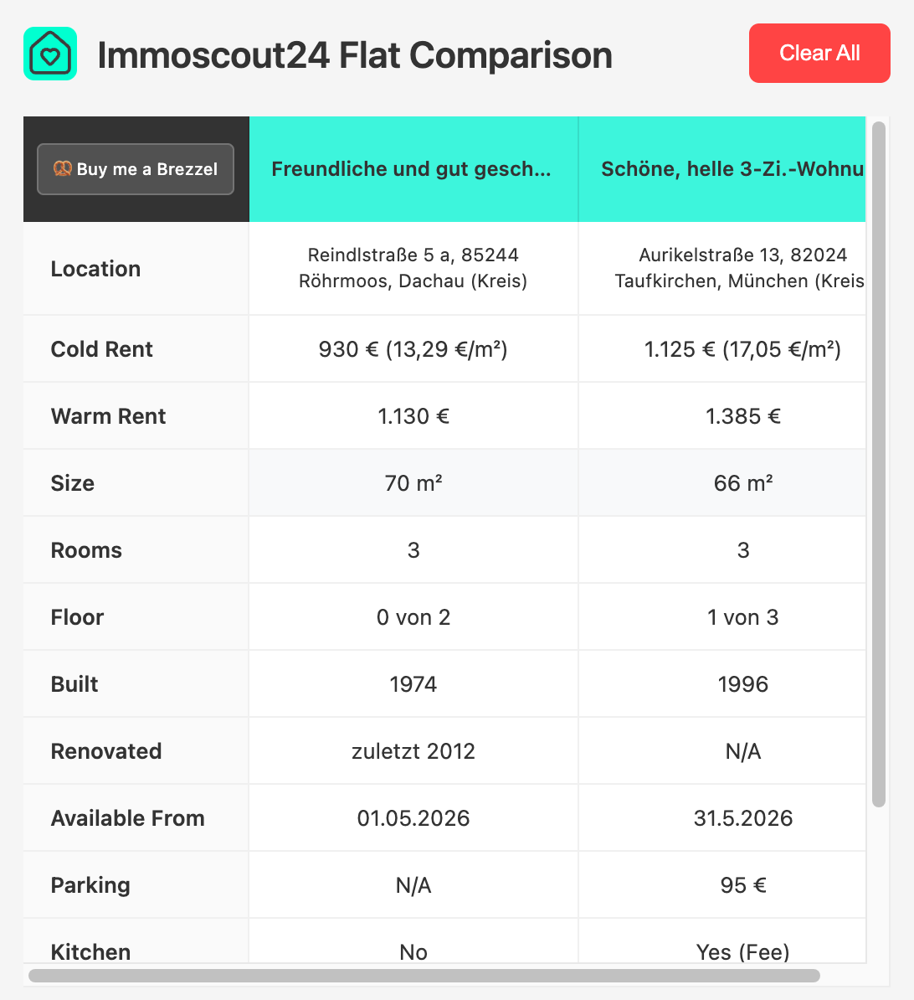

# ImmoScout24 Flat Comparison

A Chrome extension that helps you compare rental flats on ImmoScout24.de side-by-side.

## Features

- Save any listing with one click
- Compare price, size, rooms, and location in a clean table
- All data stored locally in your browser
- Direct links back to each listing

## Usage

1. Visit any flat listing on ImmoScout24.de
2. Click the **Compare Flat** button (top right of page)
3. Click the extension icon to view your comparison table

## Privacy

- 100% local - all data stored in your browser only
- No tracking or analytics
- No external servers

[Full Privacy Policy](privacy.html)

## Contributing

Pull requests are welcome.

## License

MIT License
